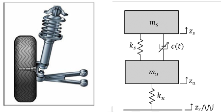
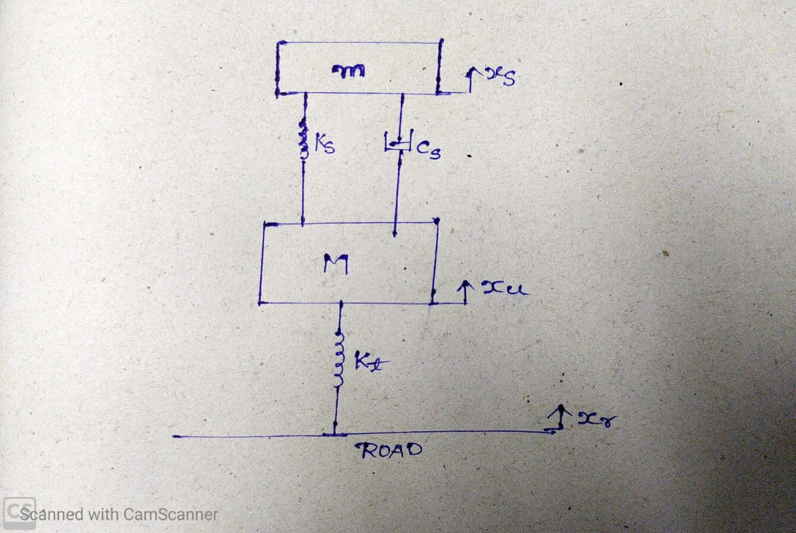
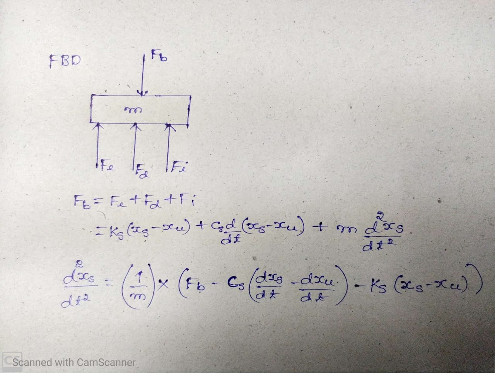
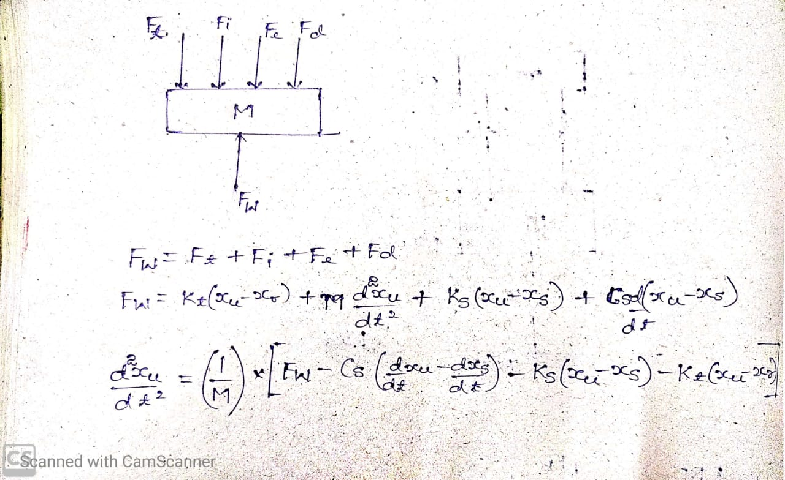
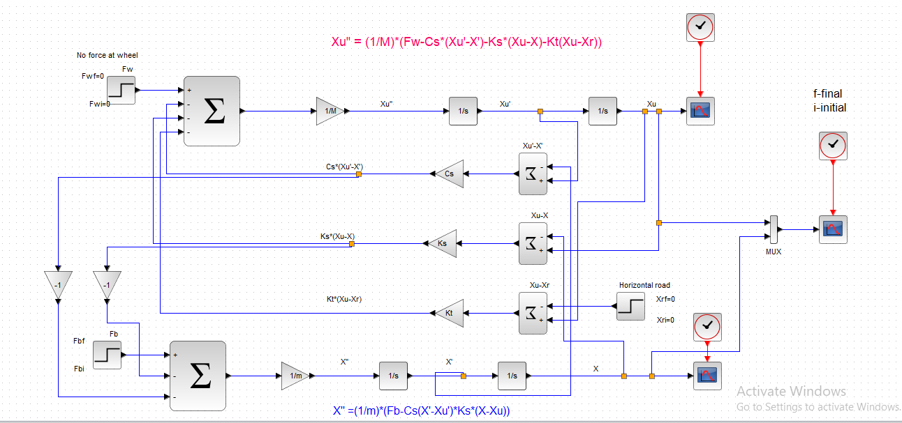
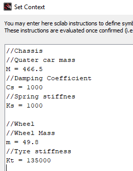

# Quarter-car-model-xcos
Modeling of tyre+spring+damper+srung mass + unsprung mass

Modeling the passive suspension of 1/4th of car i.e one tyre (mass is equally distributed among all wheels)

<pre>
ms or M[kg] – sprung mass 
m or mu[kg] – Un-sprung mass
ks[N/m] – spring constant (stiffness)
kt or ku[N/m]– tire stiffness constant 
c(t) or Cs [Ns/m] – damping coefficient
Fb [N] – external force acting on the body
Fw [N]– force exerted by the wheel
Zs or x [m] – displacement due to sprung mass of the body
Zu or xu [m] – displacement due to un-sprung mass of the body
Zr or xr [m] – Vertical displacement of road
</pre>

<strong>xcos model</strong

<strong>OUTPUT WAVEFORMS</strong>
  

Sprung mass displaccement
  

un Sprung mass displaccement
  

  
  

